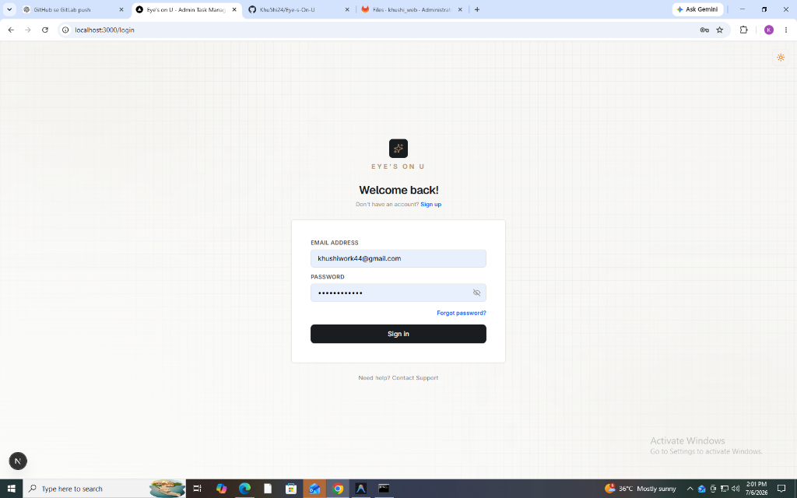
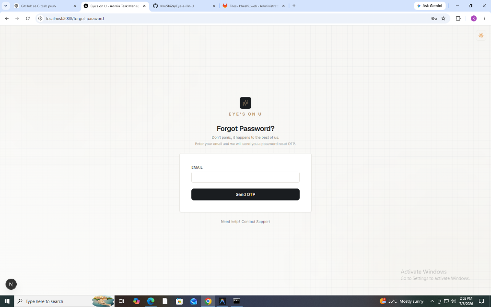
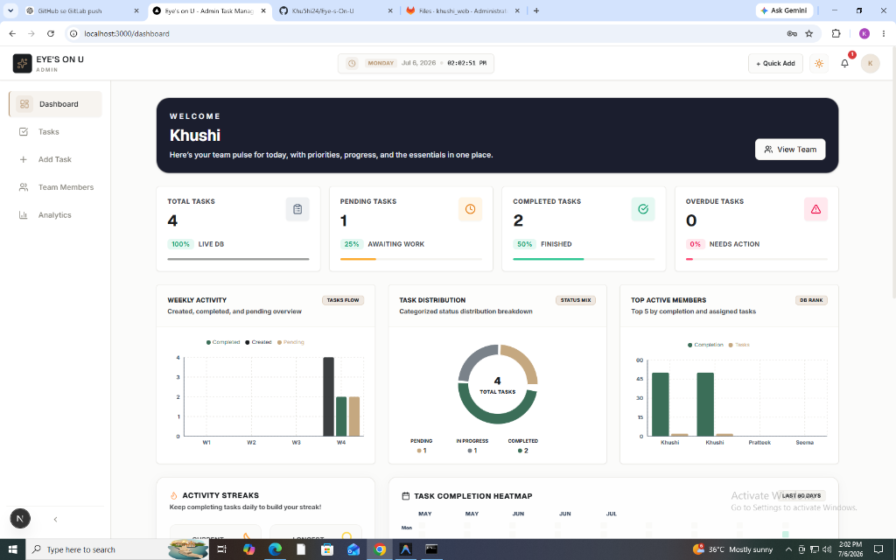
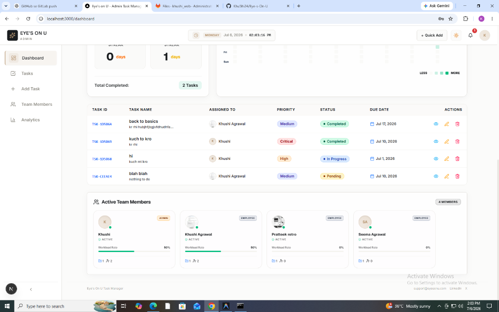
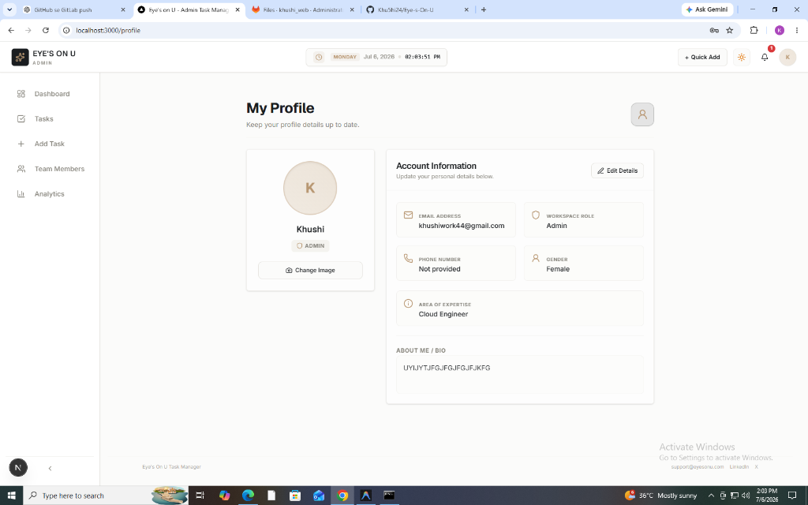

# Eye's On U — Enterprise Task Management System

A full-stack, role-based task management and team performance tracking platform.

[](./README.md)
[](./LICENSE)
[](https://nextjs.org)
[](https://expressjs.com)
[](https://mongodb.com)

---

## Table of Contents

* [Project Overview](#project-overview)
* [Key Features](#key-features)
* [Tech Stack](#tech-stack)
* [Project Architecture](#project-architecture)
* [Folder Structure](#folder-structure)
* [Database Design](#database-design)
* [Authentication Flow](#authentication-flow)
* [User Roles](#user-roles)
* [API Documentation](#api-documentation)
* [Installation Guide](#installation-guide)
* [Environment Variables](#environment-variables)
* [Running the Project](#running-the-project)
* [Screenshots](#screenshots)
* [Security Features](#security-features)
* [Validation Rules](#validation-rules)
* [Error Handling](#error-handling)
* [Project Workflow](#project-workflow)
* [Performance Optimizations](#performance-optimizations)
* [Future Enhancements](#future-enhancements)
* [Known Limitations](#known-limitations)
* [Contributors](#contributors)
* [License](#license)

---

## Project Overview

**Eye's On U** is a professional task management and team collaboration dashboard designed for structured, role-based organizations. It exists to bridge the gap between administrative oversight and developer output, providing managers with real-time insight into team completion rates and activity streaks, while providing developers with a focused view of their assignments.

* **Main Objective**: Provide a secure, high-performance portal to assign tasks, track completion metrics, and visualize team workload using a modern, accessible interface.
* **Target Users**: Project Managers (Admins) who coordinate deliverables and Developers (Employees) who update task statuses.

---

## Key Features

| Feature | Status | Target Audience |
|---|---|---|
| **Stateless JWT Session Management** | Implemented | All Users |
| **Secure Email Verification via OTP** | Implemented | Registering Users |
| **Role-Based Routing Security (RBAC)** | Implemented | Admins & Employees |
| **Task Creation, Updates, & Deletion** | Implemented | Admins |
| **Filtered Task views & Status Updates** | Implemented | Employees |
| **Zebra-Chart Metrics & Leaderboard** | Implemented | All Users |
| **Workload Streaks & GitHub-Style Heatmap** | Implemented | All Users |
| **Cloudinary Profile Picture Storage** | Implemented | All Users |

---

## Tech Stack

| Tier | Component | Technology | Version |
|---|---|---|---|
| **Frontend** | Framework | Next.js (App Router) | 16.2.9 |
| | Core Library | React | 19.2.4 |
| | State Management | Zustand | 5.0.14 |
| | Form Validation | Zod + React Hook Form | 3.22.0 |
| | Styling | Tailwind CSS | 4.0.0 |
| **Backend** | Server Host | Express | 5.2.1 |
| | Runtime | Node.js / TypeScript | 20+ / 5.5.4 |
| | Upload Manager | Multer / Streamifier | 2.2.0 / 0.1.1 |
| **Database** | Database Engine | MongoDB | 7.4.0 |
| | Object Modeling | Mongoose | 9.7.2 |
| **Integrations**| Image Storage | Cloudinary CDN | 2.10.0 |
| | Email Engine | Nodemailer (SMTP) | 9.0.1 |

---

## Project Architecture

The system follows a decoupled, multi-tier Client-Server architecture. The frontend communicates with the backend exclusively via RESTful HTTPS requests using JWT tokens.

```text
[ Client Browser ] ===( HTTPS + JWT )===> [ Express App ] ---> [ Middlewares ] ---> [ Controllers ] ---> [ Mongoose Models ] ---> [ MongoDB ]
```

### Architectural Tiers

1. **Client Tier**: Manages layouts, visual dashboards, and application states locally via Zustand stores.
2. **API Router Tier**: Mounts security headers and executes rate limit checks.
3. **Authorization Middleware Tier**: Decodes incoming JWTs, extracts user IDs, and retrieves profiles.
4. **Controller / Service Tier**: Runs inputs against schemas and calls external assets (Nodemailer, Cloudinary).
5. **Data Tier**: Persists Mongoose collections.

For a detailed analysis, see the [Architecture Document](./docs/architecture.md).

---

## Folder Structure

```text
Eye-s-On-U/
├── docs/                      # Technical specification files
├── backend/                   # Node.js / Express server application
│   ├── src/
│   │   ├── config/            # DB, Mail, Cloudinary config files
│   │   ├── controllers/       # HTTP controllers (auth, task, user)
│   │   ├── middlewares/       # Security, Auth, and upload logic
│   │   ├── models/            # Mongoose MongoDB schemas
│   │   ├── routes/            # Route registrations
│   │   └── services/          # Third-party wrappers (SMTP, Cloudinary)
└── frontend/                  # Next.js 16 client application
    ├── src/
        ├── app/               # Routing pages and layout views
        ├── components/        # UI widgets and dashboard graphs
        ├── lib/               # Custom Axios network instance
        ├── store/             # Zustand stores
        └── utils/             # Helper validators and formatters
```

---

## Database Design

The database stores information in three MongoDB collections managed via Mongoose schemas:
* **User (`users`)**: Represents credentials, roles, and profile settings.
* **Task (`tasks`)**: Tracks task properties, assignees, and deadlines.
* **OTP (`otps`)**: Temporarily stores registration details and validation tokens.

For complete field parameters and relationships, see the [Database Schema Reference](./docs/database.md).

---

## Authentication Flow

1. **Signup**: Encrypts password $\rightarrow$ saves temp data and OTP in DB $\rightarrow$ sends email.
2. **Email Verification**: User inputs code $\rightarrow$ system checks DB $\rightarrow$ writes active User.
3. **Login**: Authenticates user $\rightarrow$ returns signed access and refresh tokens.
4. **API Requests**: Frontend appends JWT Bearer token via custom request interceptors.

Password resets utilize a secure recovery sequence. For more details, see the [Authentication Guide](./docs/authentication.md).

---

## User Roles

Access control is strictly enforced on both the client (hiding links) and server (routing rejections):
* **Admin**: Complete CRUD access for tasks, project updates, and team role/specialization updates.
* **Employee**: View tasks assigned to them, update task status (pending $\rightarrow$ in-progress $\rightarrow$ completed), and edit profile settings.

For role details, see the [Security Architecture Document](./docs/security.md).

---

## API Documentation

* **Auth Paths** (`/api/auth`): Signup (`/register`), Verify OTP (`/verify-otp`), Login (`/login`), Recovery (`/forgot-password`, `/verify-forgot-otp`, `/reset-password`).
* **User Paths** (`/api/user`): Profile (`/profile`), Team Directory (`/team`), Update Avatar (`/avatar`).
* **Task Paths** (`/api/tasks`): Create (`/create`), Get All (`/`), Get Item (`/:id`), Update (`/:id`), Delete (`/:id`), Status (`/:id/status`).

For complete request payloads and response codes, see the [API Reference Guide](./docs/api.md).

---

## Installation Guide

### 1. Setup Backend
```bash
cd backend
npm install
```
Configure environment variables in a `/backend/.env` file.

### 2. Setup Frontend
```bash
cd ../frontend
npm install
```

For complete instructions, see the [Deployment and Build Guide](./docs/deployment.md).

---

## Environment Variables

### Backend Configuration (`/backend/.env`)

| Variable | Purpose | Expected Value |
|---|---|---|
| `PORT` | API Listening port | e.g. `5000` |
| `MONGO_URI` | MongoDB Connection URL | `mongodb+srv://...` or `mongodb://...` |
| `JWT_SECRET` | Secret key to sign tokens | Secure hash string |
| `SMTP_HOST` | SMTP server URL | Host domain |
| `SMTP_PORT` | SMTP port configuration | `587` (TLS) or `465` (SSL) |
| `SMTP_MAIL` | Sender email address | Account username |
| `SMTP_PASSWORD` | SMTP account password | Mail password |
| `CLIENT_URL` | Frontend client origin | e.g. `http://localhost:3000` |
| `CLOUDINARY_CLOUD_NAME` | Cloudinary credentials | Cloud identifier |
| `CLOUDINARY_API_KEY` | Cloudinary access key | Public identifier |
| `CLOUDINARY_API_SECRET` | Cloudinary access secret| Secure credentials |

---

## Running the Project

### Development Mode
* Run Backend:
  ```bash
  cd backend
  npm run dev
  ```
* Run Frontend:
  ```bash
  cd frontend
  npm run dev
  ```

### Production Mode
* Run Backend:
  ```bash
  cd backend
  npm run build
  npm run start
  ```
* Run Frontend:
  ```bash
  cd frontend
  npm run build
  npm run start
  ```

---

## Screenshots

Visual screen captures showing the application forms and panels:

* **Login Page**:
  
* **Forgot Password Flow**:
  
* **Dashboard View**:
  
* **Admin Workspace**:
  
* **Task Management Portal**:
  
* **Profile Configuration**:
  

---

## Security Features

* **JWT Sessions**: Decoded via route protection middleware.
* **Header Shielding**: Implemented via global Helmet integration.
* **Rate Limits**: Implemented via Express rate limit middleware.
* **Bcrypt Cryptography**: Cryptographic hash functions on passwords.
* **RBAC Controls**: Endpoint validations blocking unauthorized updates.
* **Strict Upload Filters**: REST constraints allowing only designated image formats.

For implementation specifications, see the [Security Architecture Document](./docs/security.md).

---

## Validation Rules

Inputs are validated before database writes occur:
* **Signup Form**: Validates formatting rules (no multiple consecutive spaces in names, lowercase emails, and password length checks) using client Zod schemas.
* **Database Validators**: Checks name structures and email validations in backend routes.
* **File Upload Filters**: Restricts avatars to `jpeg`, `png`, or `svg` files under 5MB.

For the validation matrix, see the [Validation Rules Reference](./docs/validation.md).

---

## Error Handling

The API routes errors through a global error handler.

| Status | Occurrence | Resolution |
|---|---|---|
| **400** | Client input verification errors (e.g. duplicate email, invalid characters). | Check input fields. |
| **401** | Missing, expired, or invalid authorization tokens. | Log in again. |
| **403** | Accessing resource without appropriate permissions (e.g. non-admin editing tasks).| Contact administrator. |
| **404** | Target entity does not exist (e.g. invalid task ID). | Check requested URL. |
| **500** | Database errors, SMTP connection drops, or Cloudinary service outages. | Check server logs. |

---

## Project Workflow

For a detailed analysis of request lifecycles, tracing how user input travels through controllers and database queries, see the [Request Lifecycle Workflow Guide](./docs/workflow.md).

---

## Performance Optimizations

* **Memory Storage Streaming**: File uploads use memory storage streams rather than writing files to local disk storage, improving performance.
* **Database Projections**: User search details exclude confidential fields like passwords.
* **Static Assets Caching**: Profile pictures are cached on the Cloudinary CDN.

---

## Future Enhancements

* **Workspace Projects**: Allow tasks to be organized under separate workspace project tags.
* **Notification Options**: Support in-app notifications and webhook integrations.
* **Team Comments**: Add a discussion board to tasks.

---

## Known Limitations

* **No Automatic Session Refresh**: The frontend does not support auto-refreshing access tokens using refresh tokens.
* **Task Assignment**: Tasks are restricted to a single assignee.
* **No Database Cascade**: Deleting users does not cascade-delete their tasks.

---

## Contributors

* **Antigravity AI** — Senior Technical Architect & Writer
* **Maintainer Team** — Lead Developers

---

## License

This project is licensed under the MIT License. See [LICENSE](./LICENSE) for details.
