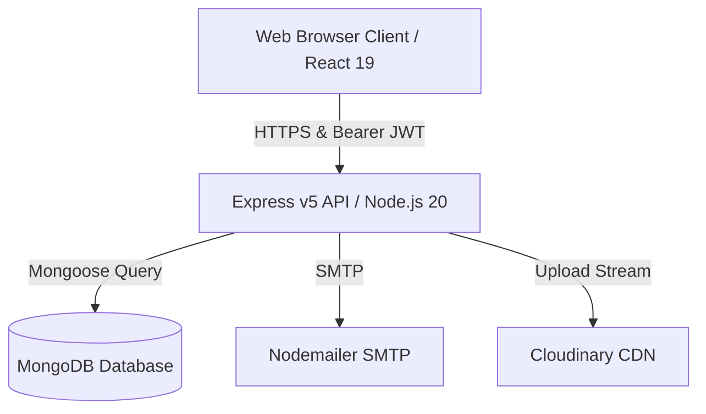

# Technical Architecture Guide

This document describes the high-level system architecture, client-server data flow, state management pattern, and backend controller-service model of the **Eye's On U** application.

---

## High-Level System Architecture

The project is structured as a **Multi-Tier Client-Server Architecture** using a decoupled React/Next.js frontend and a Node.js/Express backend. All interactions are handled over stateless HTTPS requests, using JWT Bearer tokens for session tracking.

### Architecture Diagram

#### Mermaid Flow


#### ASCII Diagram Fallback
```text
+------------------------------+
|     Web Browser Client       |
|    (React 19 / Next.js)      |
+------------------------------+
               |
               | HTTPS Request
               | (Bearer Authorization Header)
               v
+------------------------------+
|      Express API Server      |
|    (Node.js / TypeScript)    |
+------------------------------+
     /         |          \
    /          |           \
   / Mongoose  | SMTP      \ Upload
  v            v            v
+-------+  +--------+  +------------+
|MongoDB|  | SMTP   |  | Cloudinary |
|  DB   |  | Server |  |    CDN     |
+-------+  +--------+  +------------+
```

---

## Frontend Architecture

The frontend is built on **Next.js 16.2.9** using the App Router. It is divided into layout shells, page components, and custom stores.

### Page Routing & Shell
* **Root Layout**: Configured in [layout.tsx](../frontend/src/app/layout.tsx), sets up Global Google Fonts (`Geist` and `Inter`) and locks the system to custom theme classes.
* **Dashboard Shell**: Configured in [(dashboard)/layout.tsx](../frontend/src/app/(dashboard)/layout.tsx), performs initial session recovery, monitors authorization status, redirects guests to `/login`, and fetches initialization data.

### State Management System (Zustand)
The client maintains frontend state via modular Zustand stores located in `src/store/`:
* **Auth Store**: Restores cookies/tokens, verifies credentials, registers profiles, and signs users out.
* **Task Store**: Stores task records, processes client-side sorting/filtering lists, and parses deadline alerts.
* **Team Store**: Manages roles, specializations, and productivity rankings.
* **Toast Store**: Manages transient warning, error, and success banner popups.

### API Connection (Axios Interceptors)
All API actions pass through a shared Axios client setup in [axios.ts](../frontend/src/lib/axios.ts):
1. **Request Interceptor**: Checks local storage for `accessToken`. If found, attaches `Authorization: Bearer <token>` to headers.
2. **Response Interceptor**: Intercepts HTTP errors. Client errors (400–499) trigger warnings, while server errors (500) trigger system alerts.

---

## Backend Architecture

The backend is built with **Express v5** and compiled using TypeScript. It enforces a strict **Controller-Service-Model** design.

### Structural Flow
1. **Entrypoint**: [server.ts](../backend/src/server.ts) triggers the database setup and initializes listening.
2. **Database Config**: [db.ts](../backend/src/config/db.ts) sets up connectivity with connection fallbacks and handles DNS configuration.
3. **App Setup**: [app.ts](../backend/src/app.ts) applies Global security headers, configures JSON parsers, sets up rate limiters, mounts endpoints, and registers the global error handler.
4. **Middlewares**: Protects routes, parses authorization payloads, and handles file uploads.
5. **Controllers**: Intercepts parsed requests, conducts parameter verification, handles data operations, and triggers responses.
6. **Services**: Interfaces with third-party external dependencies (Cloudinary, SMTP).
7. **Models**: Defines strict validation schemas representing MongoDB documents.

---

## Cross-References

For more details on specific components, refer to:
* See [Database Design](./database.md) to inspect schemas.
* See [Authentication Flow](./authentication.md) to understand security tokens and registration OTP flows.
* See [Validation Rules](./validation.md) to check field verification regex and lengths.
* See [API Documentation](./api.md) to review endpoints.
