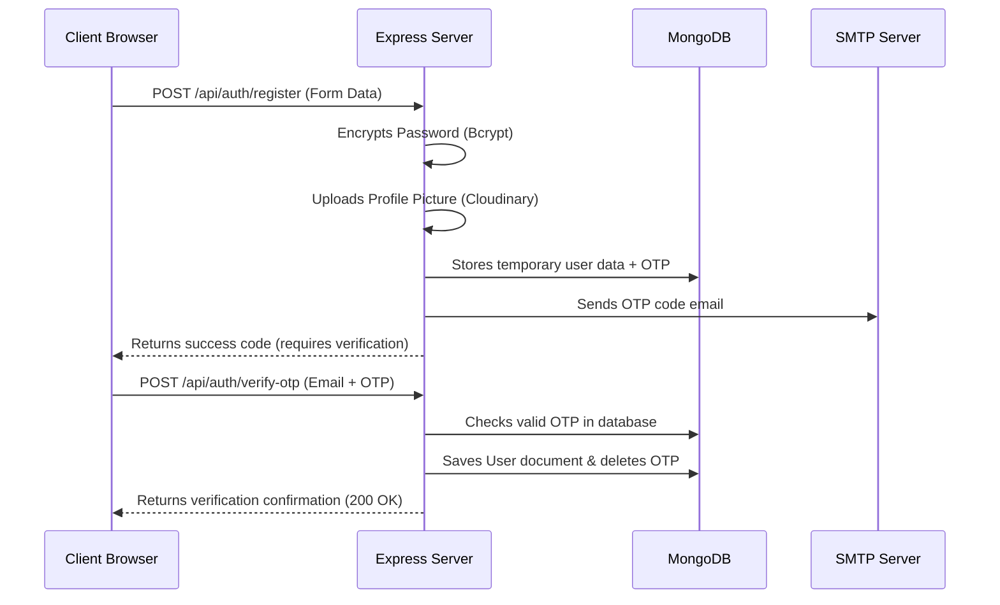
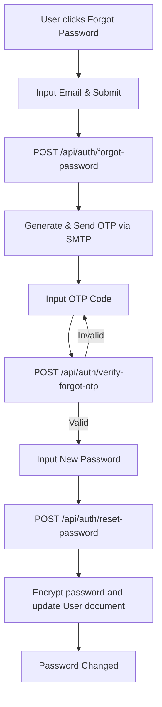

# Authentication & Authorization Guide

This document provides a technical specification of the authentication protocols, OTP verification mechanics, JWT session handling, and password recovery workflows implemented in **Eye's On U**.

---

## Technical Workflows

### 1. User Registration Flow

When a user signs up, the system generates a 6-digit numeric OTP and stores it in the `OTP` database collection alongside a 10-minute expiration window and the temporary user data. The actual `User` document is **not** written to the database until the OTP is verified.

#### Mermaid Sequence


#### ASCII Flow
```text
[Signup Request] -> [Upload Avatar] -> [Hash Password] -> [Save OTP in DB] -> [Mail OTP]
                                                                                  |
[User Verified]  <- [Write User Schema] <- [Validate OTP]  <- [Input Verification Code]
```

---

### 2. Login & JWT Session Management

Upon login, credentials are checked using Bcrypt password matching. If verified, the server generates two JWT tokens using the configured secret key:
* **Access Token**: Short-lived payload containing user ID, email, and role.
* **Refresh Token**: Long-lived reference containing the user ID.

#### Token Payload Details
```json
// Access Token Payload Structure
{
  "id": "60d0fe...",
  "email": "user@example.com",
  "role": "employee",
  "iat": 1720260000,
  "exp": 1720864800
}
```

* **Client Storage**: The frontend stores these tokens in `localStorage`.
* **Request Interception**: The Axios client automatically appends the token as a Bearer authorization header to every API request.
* **Route Protection Middleware**: The backend checks the token against the JWT secret. If it matches, the user's document is retrieved and mounted onto `req.user`.

---

### 3. Password Recovery (Forgot Password) Flow

If a user requests a password reset, the server generates an OTP and emails it. The user must verify the OTP before they are allowed to overwrite their password.

#### Mermaid Flow


#### ASCII Flow
```text
[Forgot Password] ---> [POST /forgot-password] ---> [Generate OTP] ---> [Email OTP]
                                                                             |
[Login Screen]    <--- [Update DB Document]   <--- [Verify OTP]   <--- [Input OTP]
```

---

## Security Protocols

* **Password Hashing**: Done using **Bcrypt** (salt rounds default).
* **OTP Expiration**: Enforced strictly. The database records include an `expiresAt` field set to 10 minutes from creation. Verification checks compare this date against the current system time.
* **One-Time Use**: Upon successful verification, the database record is immediately deleted to prevent replay attacks.

---

## Cross-References
* See [API reference](./api.md) for request/response payloads.
* See [Database Schema](./database.md) to inspect user role fields.
* See [Validation Rules](./validation.md) for password complexity requirements.
