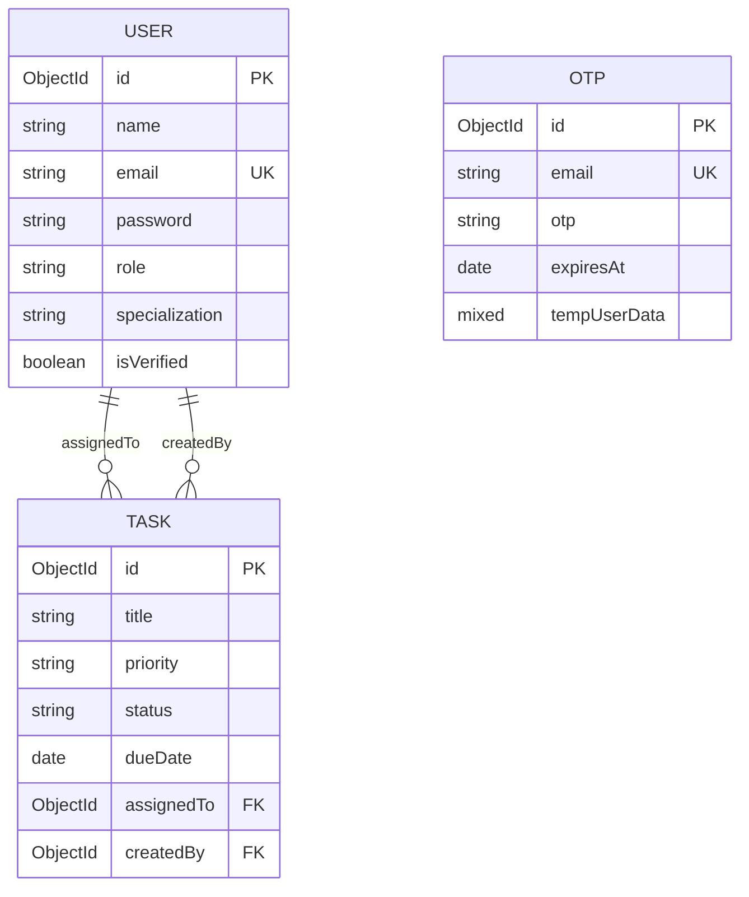

# Database Schema Guide

This document describes the database design, schema mappings, collection definitions, constraints, indices, and relationships implemented in the MongoDB/Mongoose layer of **Eye's On U**.

---

## High-Level Topology

The database layer is managed using **Mongoose ODM** over a MongoDB instance. The schema consists of three collections:
1. **users**: Stores registered profile data, credentials, and roles.
2. **tasks**: Stores task details, assignment references, and status flags.
3. **otps**: Manages temporary registration data and active verification codes.

### Relationship Diagram

#### Mermaid ERD


#### ASCII Diagram Fallback
```text
 +---------------+             +---------------+
 |     User      |1           *|     Task      |
 |---------------|<------------|---------------|
 | _id (PK)      | (assignedTo)| _id (PK)      |
 | email (Unique)|             | title         |
 | role          |1           *| assignedTo(FK)|
 | specialization|<------------| createdBy(FK) |
 +---------------+  (createdBy)+---------------+

 +---------------+
 |      OTP      |
 |---------------|
 | email (Unique)|
 | otp           |
 | expiresAt     |
 | tempUserData  |
 +---------------+
```

---

## Schema Reference

### 1. User Collection (`users`)
Stores information about authenticated team members.

| Field | Type | Required | Unique | Default | Constraints / Description |
|---|---|---|---|---|---|
| `_id` | `ObjectId` | Yes | Yes | Auto | Primary Key. |
| `name` | `String` | Yes | No | None | Trimmed. Must contain only alphabets and single spaces. |
| `email` | `String` | Yes | Yes | None | Lowercase, trimmed. Used for login. |
| `password` | `String` | Yes | No | None | Stored as a secure Bcrypt hash. |
| `avatar` | `String` | No | No | `""` | Cloudinary profile image secure URL. |
| `bio` | `String` | No | No | `""` | Self-description text. |
| `specialization` | `String` | No | No | `""` | Dev focus (e.g., Frontend, Backend). Admin-writable. |
| `phone` | `String` | No | No | `""` | Mobile contact number. |
| `gender` | `String` | No | No | `""` | User demographic selection. |
| `role` | `String` | Yes | No | `"employee"` | Enum: `['admin', 'employee', 'user']`. |
| `isVerified` | `Boolean` | Yes | No | `false` | True only after registration OTP verification. |
| `createdAt` | `Date` | Yes | No | Auto | Handled by Mongoose `timestamps`. |
| `updatedAt` | `Date` | Yes | No | Auto | Handled by Mongoose `timestamps`. |

---

### 2. Task Collection (`tasks`)
Stores information about work items assigned to users.

| Field | Type | Required | Unique | Default | Constraints / Description |
|---|---|---|---|---|---|
| `_id` | `ObjectId` | Yes | Yes | Auto | Primary Key. |
| `title` | `String` | Yes | No | None | Trimmed. Name of the work item. |
| `description` | `String` | No | No | `""` | Extended task specifications. |
| `priority` | `String` | Yes | No | None | Enum: `['low', 'medium', 'high', 'critical']`. |
| `status` | `String` | Yes | No | `"pending"` | Enum: `['pending', 'in-progress', 'completed', 'overdue']`. |
| `dueDate` | `Date` | Yes | No | None | Work item deadline. |
| `assignedTo` | `ObjectId` | Yes | No | None | References the `User` collection. |
| `createdBy` | `ObjectId` | Yes | No | None | References the `User` collection (admin creator). |
| `createdAt` | `Date` | Yes | No | Auto | Handled by Mongoose `timestamps`. |
| `updatedAt` | `Date` | Yes | No | Auto | Handled by Mongoose `timestamps`. |

---

### 3. OTP Collection (`otps`)
Stores active tokens for signup verification and password recovery.

| Field | Type | Required | Unique | Default | Constraints / Description |
|---|---|---|---|---|---|
| `_id` | `ObjectId` | Yes | Yes | Auto | Primary Key. |
| `email` | `String` | Yes | Yes | None | Lowercase, trimmed. Email targeted for verification. |
| `otp` | `String` | Yes | No | None | 6-digit numeric verification code. |
| `expiresAt` | `Date` | Yes | No | None | Code expiration limit (10 minutes from creation). |
| `tempUserData` | `Mixed` | No | No | None | Pre-registration user model fields held during verification. |
| `createdAt` | `Date` | Yes | No | Auto | Handled by Mongoose `timestamps`. |
| `updatedAt` | `Date` | Yes | No | Auto | Handled by Mongoose `timestamps`. |

---

## Referential Integrity & Indices

1. **Foreign Keys**:
   - `Task.assignedTo` connects to `User._id`.
   - `Task.createdBy` connects to `User._id`.
   - These fields are populated dynamically on retrieval using Mongoose `.populate()`.
2. **Unique Fields**:
   - Unique index built on `User.email` to prevent account duplication.
   - Unique index built on `OTP.email` ensuring that a user can have at most one pending verification session.
3. **Database Cascading**:
   - When a user is deleted, active tasks assigned to them are **not** cascade-deleted; their reference remains intact.
   - Cleaning up OTPs occurs automatically upon code entry or validation.

---

## Cross-References
* See [Authentication Guide](./authentication.md) to inspect temp user writing.
* See [API documentation](./api.md) to review JSON schemas for payloads.
